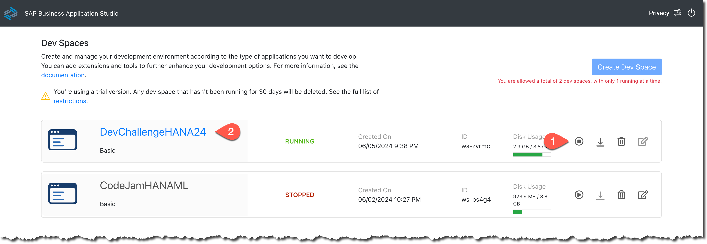
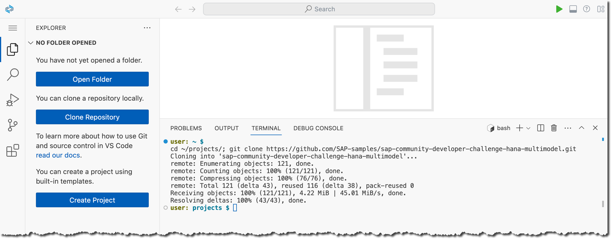
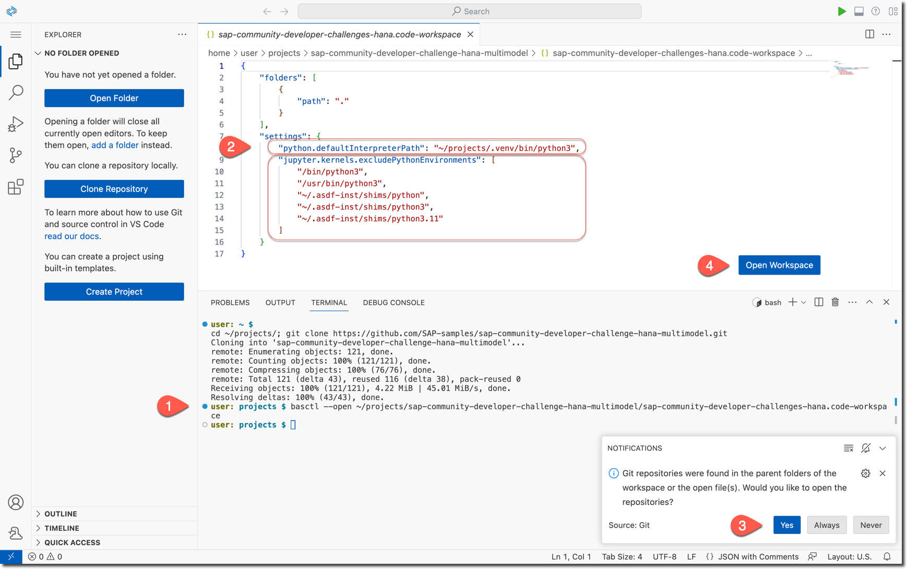
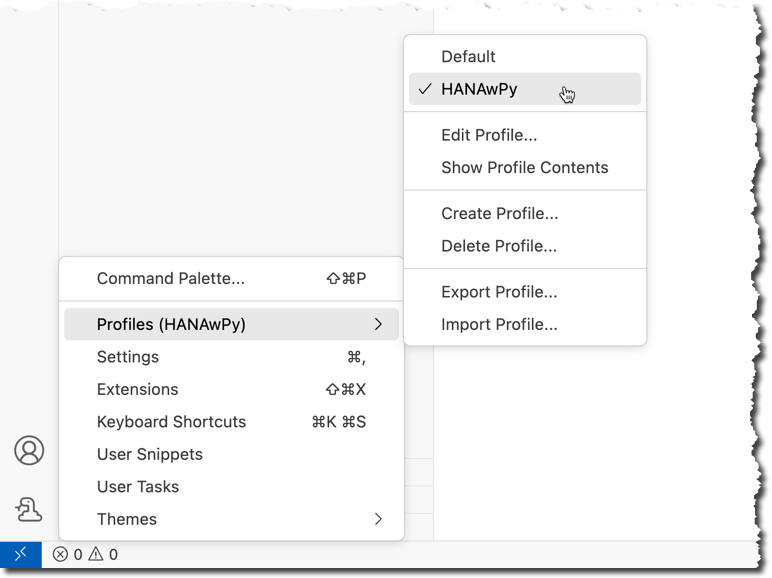

## Week 2 Challenge: Words as Vectors in SAP HANA database

During this week 2 of the June 2024 challenge, you are going to use the [Vector Engine of the SAP HANA database](https://community.sap.com/t5/technology-blogs-by-sap/sap-hana-cloud-vector-engine-quick-faq-reference/ba-p/13675212) in the SAP HANA Cloud to load, store and process embeddings: words represented as vectors. Embeddings are used in many modern use cases involving Artificial Intelligence requiring semantic search.

In this exercise, you will use embeddings already created with [Word2vec](https://code.google.com/archive/p/word2vec/) project.

1. Check your instance of the SAP HANA database in the SAP Business Technology Platform is running.


2. Start (if needed) and open the dev space in the SAP Business Application Studio that you set up earlier.



3. Clone the repository with the Jupyter Notebooks for this week's challenge into `~/projects/` directory.

```shell
cd ~/projects/; git clone https://github.com/SAP-samples/sap-community-developer-challenge-hana-multimodel.git
```



4. Open the workspace file from the cloned project.

Let's use the [`basctl` to open the workspace file](https://community.sap.com/t5/application-development-blog-posts/opening-files-from-the-terminal-in-bas-dev-spaces/ba-p/13606953).

```shell
basctl --open ~/projects/sap-community-developer-challenge-hana-multimodel/sap-community-developer-challenges-hana.code-workspace
```



> [!NOTE]
> This workspace file has already `"python.defaultInterpreterPath"` pointing to the Python runtime `"~/projects/.venv/bin/python3"`, which you have configured with the virtual environment before.

Open the Git repository. Open the Workspace.

You obviously still could click the Explorer -> File -> Open Workspace from File... in the UI, but you wouldn't impress [DJ Adams](https://www.linkedin.com/in/djadams/) with that 🤓

5. Make sure that `HANAwPy` profile is open.



6. Install the `gensim` package into your virtual environment.

In the Terminal session activate the Python's virtual environment `.venv` set during the setup exercise.

```shell
source ~/projects/.venv/bin/activate
```

Install the [`gensim` package](https://radimrehurek.com/gensim/intro.html#what-is-gensim) inclding the `scipy` dependnecy using the compatible version.

```shell
pip install --require-virtualenv gensim 'scipy<1.13'
```

7. Open and execute `week2*` notebooks from the `challenges` folder

There are two sets of `week2*` notebooks in the project:
- those in the [`challenges`](../notebooks/challenges/) folder are for you to execute;
- those in the [`solutions`](../notebooks/solutions/) folder are saved with the output of the execution of all cells for you reference.

The kernel for the notebook should be automatically set to **`.venv`**, thanks to the settings in the workspace file [`sap-community-developer-challenges-hana.code-workspace`](../sap-community-developer-challenges-hana.code-workspace).


> [!IMPORTANT] 
> Make sure that you read the comments explaining what is happening, and ask your questions in https://community.sap.com/t5/application-development-discussions/submissions-for-quot-sap-hana-cloud-multi-model-quot-developer-challenge/m-p/13728400#M2028459 if needed.

8. At the end of the notebook `week2_2_queries.ipynb` in the last cell, experiment with different values for the variable to find some interesting example to share as a screenshot as your submission for week 2: https://community.sap.com/t5/application-development-discussions/submissions-for-quot-sap-hana-cloud-multi-model-quot-developer-challenge/m-p/13728400#M2028459